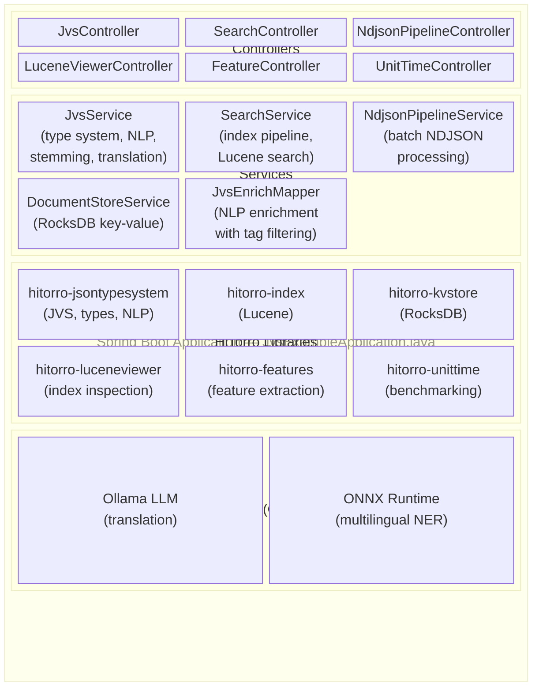
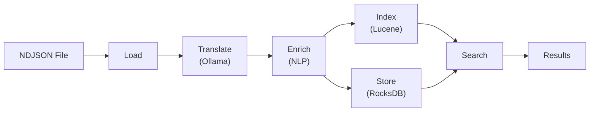

# HiTorro JVS Spring Boot Example

A comprehensive Spring Boot application demonstrating the **hitorro-jsontypesystem** library with integrated Lucene search, RocksDB document storage, multi-language NLP enrichment, NER (Named Entity Recognition via MaxEnt and ONNX transformer models), AI-powered translation, feature extraction, performance benchmarking, and NDJSON document processing pipelines.

This application serves as both a reference implementation and an interactive playground for exploring the HiTorro type system and NLP capabilities.

---

## Table of Contents

- [Quick Start](#quick-start)
- [Prerequisites](#prerequisites)
- [Building](#building)
- [Running](#running)
- [Testing](#testing)
- [Architecture](#architecture)
- [Project Structure](#project-structure)
- [Core Services](#core-services)
- [REST API Reference](#rest-api-reference)
- [Type System](#type-system)
- [NLP Enrichment](#nlp-enrichment)
- [AI Translation (Ollama)](#ai-translation-ollama)
- [Search, Indexing & Document Storage](#search-indexing--document-storage)
- [NDJSON Pipeline Processing](#ndjson-pipeline-processing)
- [Feature Extraction](#feature-extraction)
- [Performance Benchmarking (UnitTime)](#performance-benchmarking-unittime)
- [Interactive Web UI](#interactive-web-ui)
- [Demo Dataset](#demo-dataset)
- [Configuration Reference](#configuration-reference)
- [Troubleshooting](#troubleshooting)
- [Extensibility](#extensibility)

---

## Quick Start

```bash
# 1. Build (from the hitorro-jvs-example-springboot directory)
cd hitorro-jvs-example-springboot
mvn clean package -DskipTests

# 2. (Optional) Download ONNX NER model for multilingual NER support
#    Requires Python 3.8+ -- only needed once
cd .. && ./download-onnx-models.sh && cd hitorro-jvs-example-springboot

# 3. Run (HT_BIN tells the app where to find config/ and data/)
mvn spring-boot:run -DHT_BIN=/path/to/hitorro

# Or run the JAR directly
java -DHT_BIN=/path/to/hitorro -jar target/hitorro-jsontypesystem-example-springboot-1.0.0.jar
```

Open [http://localhost:8080](http://localhost:8080) to access the interactive UI.

---

## Prerequisites

| Requirement | Version | Notes |
|-------------|---------|-------|
| **Java** | 21+ | Required. Uses Java 21 language features (pattern matching, text blocks, sealed classes) |
| **Maven** | 3.8+ | Required for building |
| **Parent hitorro project** | -- | Must have `config/` (type definitions) and `data/` (NLP models) directories available |
| **Ollama** | Any | Optional. Required only for AI translation features. Install from [ollama.com](https://ollama.com) |
| **Python** | 3.8+ | Optional. One-time setup for ONNX NER model export |

### NLP Model Setup

The app uses OpenNLP models from `data/opennlpmodels1.5/` for sentence detection, tokenization, POS tagging, and NER. These are included in the parent repository.

For multilingual NER via ONNX transformer (German, French, Italian, Portuguese, etc.):

```bash
# One-time setup (requires Python 3.8+ and pip)
cd /path/to/hitorro
./download-onnx-models.sh
```

This exports the `Davlan/xlm-roberta-base-ner-hrl` model (~1GB ONNX) to `data/opennlpmodels-onnx/ner-multilingual/`. After this, NER enrichment works for all supported languages. When `.bin` models are unavailable for a language, NER automatically falls back from MaxEnt to ONNX.

---

## Building

### Full Build with Tests

```bash
cd hitorro-jvs-example-springboot
mvn clean package
```

### Build without Tests

```bash
mvn clean package -DskipTests
```

### What the Build Does

The Maven build performs two additional resource-copy steps (configured via `maven-resources-plugin`):

1. **Copies type definitions** from `../config/types/*.json` into `config/types/` within the module
2. **Copies JSON schemas** from `../config/schemas/*.schema.json` into `config/schemas/` within the module

This ensures the app has access to type definitions even when run standalone. The `spring-boot-maven-plugin` creates an executable fat JAR.

### Build Dependencies

| Library | Version | Purpose |
|---------|---------|---------|
| Spring Boot Starter Web | 3.2.2 | REST framework, embedded Tomcat |
| hitorro-jsontypesystem | 3.0.1 | JVS type system, NLP enrichment, Snowball stemming |
| hitorro-index | 3.0.0 | Lucene full-text indexing and search with type-aware field mapping |
| hitorro-kvstore | 3.0.1 | RocksDB persistent key-value document storage |
| hitorro-luceneviewer | 3.0.0 | Lucene index inspection and browsing tools |
| hitorro-unittime | 3.0.1 | CPU-aware performance microbenchmarking |
| hitorro-features | 3.0.1 | Feature extraction, indexing, and querying framework |
| Spring Boot Starter Test | 3.2.2 | JUnit 5, MockMvc, AssertJ |

HiTorro artifacts are resolved from:
- Maven Central
- `hitorro-maven` GitHub repository (https://raw.githubusercontent.com/geekychris/hitorro-maven/main)

---

## Running

### With Type System (Full Functionality)

```bash
# Via Maven
mvn spring-boot:run -DHT_BIN=/path/to/hitorro

# Via JAR
java -DHT_BIN=/path/to/hitorro -jar target/hitorro-jsontypesystem-example-springboot-1.0.0.jar
```

### Without Type System (Graceful Degradation)

```bash
# Works -- type-dependent features degrade gracefully
mvn spring-boot:run
```

When `HT_BIN` is not set, the app attempts auto-detection by checking the current directory and parent directory for `config/types` and `data/` directories. If not found, type-dependent features (enrichment, validation, type explorer) return informative error responses instead of crashing. Features that don't require the type system (stemming, merge, document creation) continue to work normally.

### With Ollama Translation

```bash
# Start Ollama (separate terminal)
ollama serve
ollama pull llama3.2

# Start the app
mvn spring-boot:run -DHT_BIN=/path/to/hitorro
```

### Custom Port

```bash
mvn spring-boot:run -DHT_BIN=/path/to/hitorro -Dserver.port=9090
```

---

## Testing

### Running All Tests

```bash
mvn test
```

### Test Suites

The application includes two test suites:

#### `JvsExampleApplicationTest` -- Spring Boot Integration Tests

Uses `@SpringBootTest` with `MockMvc` to test REST endpoints. **Designed to work without `HT_BIN` set**, demonstrating graceful degradation:

| Test | What It Verifies |
|------|-----------------|
| `contextLoads` | Spring context starts successfully |
| `shouldStemText` | English Snowball stemming (`running` -> `run`, `dogs` -> `dog`) |
| `shouldStemGermanText` | German Snowball stemming |
| `shouldMergeDocuments` | Deep merge of two JSON documents (overlay wins on conflicts) |
| `shouldListTypes` | `/api/jvs/types` returns an array (may be empty without type system) |
| `shouldReturnStatus` | `/api/jvs/status` returns type system state, type count, translation info |
| `shouldServeStaticPage` | Static HTML UI is served at `/index.html` |
| `shouldCreateDocument` | Document creation adds `_meta.processed`, `_meta.timestamp` |
| `shouldReturnErrorForEnrichWithoutType` | Enrichment returns `error` field (not 500) when document has no type |
| `shouldReturnErrorForStructuredEnrichWithoutType` | Structured enrich request also degrades gracefully |
| `shouldReturnErrorForValidateWithoutType` | Validation returns `valid: false` with explanation |
| `shouldReturn404ForMissingType` | Unknown type name returns HTTP 404 |

#### `MlsTranslationTest` -- Unit Tests for MLS Translation

Pure unit tests (no Spring context) testing `JVS.append()` and `JVS2JVSTranslationMapper`:

| Test Group | Tests | What They Verify |
|-----------|-------|-----------------|
| **JVS.append** | 4 tests | Appending MLS elements to arrays, preserving existing fields, empty arrays, Propaccess indexing after append |
| **JVS2JVSTranslationMapper** | 10 tests | Multi-field/multi-language translation, skipping missing source language, skipping existing translations, skipping source language in targets, null JVS handling, `skipOnError` behavior, builder validation (required fields), stream pipeline compatibility |

Uses fake translation functions (no Ollama required) with a fixed translation map for deterministic testing.

### Running a Single Test Class

```bash
mvn test -Dtest=JvsExampleApplicationTest
mvn test -Dtest=MlsTranslationTest
```

### Running a Single Test Method

```bash
mvn test -Dtest=MlsTranslationTest#shouldTranslateMultipleFieldsAndLanguages
```

---

## Architecture



### Key Architectural Patterns

- **Spring Dependency Injection**: Services are `@Service` beans autowired into `@RestController` classes. Controllers are stateless; services hold state (index handles, KV store connections).
- **Stream Pipelines**: Document processing uses Java Streams and HiTorro's `JSONIterator`/`AbstractIterator`/`JsonSink` for composable transformations.
- **Builder Pattern**: `JVS2JVSTranslationMapper.builder()`, `IndexConfig.builder()`, `DatabaseConfig.builder()` for fluent configuration.
- **Graceful Degradation**: All endpoints handle missing type system, missing Ollama, or missing NLP models without crashing. Errors are returned as structured JSON.
- **Configuration Resolution**: `HT_BIN` is resolved from system property -> environment variable -> auto-detection from parent/current directory.

### Data Flow: Index Pipeline



---

## Project Structure

```
hitorro-jvs-example-springboot/
├── pom.xml                                    Maven build config
├── README.md                                  This file
├── src/
│   ├── main/
│   │   ├── java/com/hitorro/jvs/example/
│   │   │   ├── JvsExampleApplication.java     Spring Boot entry point
│   │   │   ├── JvsService.java                Type system, stemming, translation
│   │   │   ├── JvsController.java             REST: types, documents, enrichment, stemming
│   │   │   ├── JvsEnrichMapper.java           NLP enrichment with tag-based filtering
│   │   │   ├── SearchService.java             Lucene indexing & search pipeline
│   │   │   ├── SearchController.java          REST: index, search, document fetch
│   │   │   ├── DocumentStoreService.java      RocksDB key-value store wrapper
│   │   │   ├── NdjsonPipelineService.java     NDJSON batch processing (iterator + stream)
│   │   │   ├── NdjsonPipelineController.java  REST: pipeline operations
│   │   │   ├── LuceneViewerController.java    REST: index inspection and browsing
│   │   │   ├── FeatureController.java         REST: feature extraction and indexing
│   │   │   ├── UnitTimeController.java        REST: performance benchmarking
│   │   │   └── WebConfig.java                 Redirects / to /index.html
│   │   └── resources/
│   │       ├── application.yml                Spring Boot configuration
│   │       └── static/index.html              Interactive single-page UI
│   └── test/
│       └── java/com/hitorro/jvs/example/
│           ├── JvsExampleApplicationTest.java  Integration tests (MockMvc)
│           └── MlsTranslationTest.java         Unit tests (JVS translation)
├── config/
│   ├── types/                                 Type definitions (copied from parent at build)
│   │   ├── core_*.json                        Foundation types (string, id, mls, sysobject, etc.)
│   │   ├── demo_*.json                        Example types (document, article, person, etc.)
│   │   └── dm_*.json                          Document management types
│   └── schemas/                               JSON validation schemas
│       └── *.schema.json
└── data/
    ├── demo-documents.ndjson                  10-document demo dataset
    ├── demo-documents-*.ndjson                Pipeline output files
    └── kvstore/                               RocksDB persistent storage
```

---

## Core Services

### JvsService

The primary service class. Initializes the type system on startup and provides operations for:

- **Type exploration**: List types, get type definitions with field hierarchies, dynamic field metadata, and group information
- **Propaccess navigation**: Navigate JSON documents using dot-notation paths (e.g., `title.mls[0].text`)
- **Document operations**: Create documents with metadata, deep-merge two documents, validate against type schemas
- **NLP enrichment**: Apply dynamic field computation with tag-based filtering
- **Snowball stemming**: 8 languages -- English, German, French, Spanish, Dutch, Portuguese, Italian, Swedish
- **AI translation**: Translate MLS fields via Ollama LLM with configurable model

### SearchService

Manages the complete search pipeline:

- Loads NDJSON documents and processes them through translate -> enrich -> index stages
- Creates in-memory Lucene indices with type-aware field projection
- Stores processed documents in both Lucene and RocksDB
- Executes Lucene queries with faceting and multi-language support
- Supports fetching full documents from either the index (`_source` field) or the KV store

### NdjsonPipelineService

Demonstrates two equivalent batch processing approaches:

- **Iterator-based**: `JSONIterator` -> `AbstractIterator.map()` -> `JsonSink` (HiTorro streaming API)
- **Stream-based**: `List.stream().map()` (Java Streams API)
- **Bridges**: `JSONIterator.toStream()` and `AbstractIterator.fromStream()` for interop

### DocumentStoreService

Wraps RocksDB for persistent document storage:

- Keys are derived from document identity: `{domain}/{did}`
- Supports single and batch put/get operations
- Used as an alternative retrieval source during search (index for ranking, KV store for full documents)

### JvsEnrichMapper

Bridges the HiTorro enrichment framework to the example app:

- Wraps `EnrichExecutionBuilderMapper` for NLP dynamic field computation
- Filters enrichment groups by tag (e.g., only run `ner` and `segmented` groups)
- Always includes "null-tagged" groups (groups without tags are always executed)
- Caches `ExecutionBuilder` instances by tag set for performance

---

## REST API Reference

### Type System & Documents (`/api/jvs/`)

| Endpoint | Method | Description |
|----------|--------|-------------|
| `/api/jvs/types` | GET | List all available type names |
| `/api/jvs/types/{typeName}` | GET | Get type definition (fields, groups, dynamic info) |
| `/api/jvs/status` | GET | System status (type system state, Ollama availability) |
| `/api/jvs/propaccess` | POST | Navigate a document via dot-notation path |
| `/api/jvs/documents` | POST | Create a JVS document with metadata |
| `/api/jvs/merge` | POST | Deep merge two documents (overlay wins on conflicts) |
| `/api/jvs/validate` | POST | Validate document against its type schema |
| `/api/jvs/enrich` | POST | Enrich document with NLP dynamic fields |
| `/api/jvs/stem` | POST | Stem text using Snowball (8 languages) |
| `/api/jvs/translate` | POST | Translate MLS fields via Ollama |
| `/api/jvs/translate/status` | GET | Check Ollama availability |

### Search & Indexing (`/api/jvs/search/`)

| Endpoint | Method | Description |
|----------|--------|-------------|
| `/api/jvs/search/index` | POST | Index dataset with optional enrichment and translation |
| `/api/jvs/search` | GET | Search with query, facets, language, KV store toggle |
| `/api/jvs/search/doc/{domain}/{did}` | GET | Fetch single document from KV store |
| `/api/jvs/search/fields/{typeName}` | GET | Get indexed field names for a type |
| `/api/jvs/search/status` | GET | Index and KV store status |

### Index Viewer (`/api/jvs/viewer/`)

| Endpoint | Method | Description |
|----------|--------|-------------|
| `/api/jvs/viewer/stats` | GET | Index statistics (doc count, fields, segments) |
| `/api/jvs/viewer/fields` | GET | List all indexed fields with cardinality |
| `/api/jvs/viewer/documents` | GET | Browse stored documents (paginated) |
| `/api/jvs/viewer/documents/{docId}` | GET | Get a specific stored document |
| `/api/jvs/viewer/terms/{field}` | GET | Browse terms in a field (paginated) |
| `/api/jvs/viewer/search` | GET | Full-text search within the index |

### NDJSON Pipeline (`/api/jvs/pipeline/`)

| Endpoint | Method | Description |
|----------|--------|-------------|
| `/pipeline/dataset` | GET | List all documents in the NDJSON dataset |
| `/pipeline/dataset/count` | GET | Get document count and file path |
| `/pipeline/enrich/iterator` | POST | Enrich via HiTorro iterator pipeline |
| `/pipeline/enrich/stream` | POST | Enrich via Java Streams pipeline |
| `/pipeline/translate/iterator` | POST | Translate via HiTorro iterator pipeline |
| `/pipeline/translate/stream` | POST | Translate via Java Streams pipeline |
| `/pipeline/combined/iterator` | POST | Enrich + translate via iterator pipeline |
| `/pipeline/combined/stream` | POST | Enrich + translate via Java Streams pipeline |
| `/pipeline/bridge/iterator-to-stream` | POST | Demo: `JSONIterator.toStream()` bridge |
| `/pipeline/bridge/stream-to-sink` | POST | Demo: `AbstractIterator.fromStream()` -> `JsonSink` |

### Feature Extraction (`/api/features/`)

| Endpoint | Method | Description |
|----------|--------|-------------|
| `/api/features/status` | GET | Feature definitions and extraction state |
| `/api/features/extract` | POST | Extract features from a single document |
| `/api/features/extract-batch` | POST | Extract features from a document array |
| `/api/features/index` | POST | Build feature index from extracted data |
| `/api/features/query` | GET | Query feature value by docId and feature name |
| `/api/features/extracted` | GET | List all extracted documents and their features |
| `/api/features/clear` | POST | Clear extraction cache |

### Performance Benchmarking (`/api/unittime/`)

| Endpoint | Method | Description |
|----------|--------|-------------|
| `/api/unittime/status` | GET | CPU frequency, JVM version, OS info |
| `/api/unittime/categories` | GET | Available benchmark categories |
| `/api/unittime/run` | GET | Execute benchmarks (optional `filter` and `ghz` params) |

---

## Type System

The JSON Type System (JVS) is the core abstraction. Type definitions live in `config/types/*.json` and define the structure, behavior, and processing rules for documents.

### Type Categories

**Core types** (primitives and foundations):
- `core_string`, `core_long`, `core_boolean` -- Primitive wrappers
- `core_date`, `core_dates` -- Date handling
- `core_id` -- Identity with `domain` and `did` fields
- `core_url` -- URL with automatic parsing
- `core_mls` -- Multi-Language String array
- `core_mlselem` -- MLS element with NLP dynamic fields (clean, stems, segmented_text, segmented_ner, etc.)
- `core_sysobject` -- Base document type (all domain types extend this)

**Demo types** (examples):
- `demo_document` -- Main demo type: title, body, author, department, keywords, classification
- `demo_article`, `demo_person`, `demo_product`, `demo_property`, `demo_event`, `demo_recipe`, `demo_ticket`

**Document Management types** (`dm_*`):
- `dm_versionable_object`, `dm_metadata`, `dm_times`, `dm_reference`, `dm_category`, `dm_id`

### Type Definition Structure

Each type definition JSON includes:
- **Fields**: Named, typed properties with optional `vector` (array), `i18n` (multi-language), and `dynamic` (computed) markers
- **Groups**: Collections of fields with search methods (`text_s`, `keyword_s`, `long_s`, etc.) and tags for selective enrichment
- **Dynamic fields**: Computed at enrichment time by Java classes (e.g., Snowball stemmer, sentence segmenter, NER processor)
- **Inheritance**: Types can extend other types via the `super` reference

### Propaccess

Dot-notation path navigation for JSON documents. Examples:

```
id.did              -> Document ID
title.mls[0].text   -> First MLS entry's text
body.mls[0].clean   -> Cleaned body text (after enrichment)
keywords[2]         -> Third keyword
```

---

## NLP Enrichment

Enrichment computes dynamic fields on documents based on their type definition. Dynamic fields are grouped by tags, allowing selective enrichment.

### Enrichment Tags

| Tag | NLP Feature | What It Produces |
|-----|-------------|------------------|
| `basic` | Stemming, normalization | `stems` (stemmed text), `clean` (normalized text) |
| `segmented` | Sentence segmentation | `segmented_text` (sentence-split text) |
| `ner` | Named Entity Recognition | `segmented_ner` (NER-annotated text with person, location, organization, date, money tags) |
| `pos` | Part-of-speech tagging | POS-annotated text |
| `hash` | Text hashing | Normalized text hash for deduplication |
| `parsed` | Dependency parsing | Parse tree structure |

### NER Models

- **MaxEnt** (OpenNLP `.bin` models): Available for English and other languages with pre-trained models in `data/opennlpmodels1.5/`
- **ONNX Transformer** (`xlm-roberta-base-ner-hrl`): Multilingual NER for German, French, Italian, Portuguese, Spanish, and more. Falls back automatically when MaxEnt models are unavailable for a language.

### Example: Enrichment Request

```bash
curl -X POST http://localhost:8080/api/jvs/enrich \
  -H "Content-Type: application/json" \
  -d '{
    "json": "{\"type\": \"demo_document\", \"title\": {\"mls\": [{\"lang\": \"en\", \"text\": \"Meeting with Dr. Smith in New York\"}]}}",
    "tags": "basic,segmented,ner"
  }'
```

After enrichment, the MLS element gains computed fields:
- `clean`: `"meeting with dr. smith in new york"`
- `stems`: `"meet dr smith new york"`
- `segmented_text`: Sentence-split text
- `segmented_ner`: `"Meeting with <person>Dr. Smith</person> in <location>New York</location>"`

---

## AI Translation (Ollama)

The app integrates with [Ollama](https://ollama.com) for AI-powered document translation. Translation adds new MLS entries to Multi-Language String arrays.

### Setup

```bash
# Install Ollama and pull a model
ollama serve
ollama pull llama3.2
```

### How It Works

1. The `JVS2JVSTranslationMapper` iterates over configured MLS fields (e.g., `title.mls`, `body.mls`)
2. For each field, it finds the source language entry (e.g., `lang: "en"`)
3. For each target language not already present, it calls Ollama to translate the text
4. Translated text is appended as a new `{lang, text}` entry in the MLS array
5. Existing translations are preserved (not overwritten)

### Translation in the Index Pipeline

When indexing, translation runs *before* enrichment so that NLP dynamic fields are computed for all languages (original and translated):

```java
documents.stream()
    .map(translate)   // Add German, Spanish, French MLS entries
    .map(enrich)      // Compute NLP fields for ALL languages
    .forEach(index);  // Create language-specific Lucene fields
```

### Example: Translation Request

```bash
curl -X POST http://localhost:8080/api/jvs/translate \
  -H "Content-Type: application/json" \
  -d '{
    "json": "{\"title\": {\"mls\": [{\"lang\": \"en\", \"text\": \"Climate Change Report\"}]}}",
    "fields": ["title"],
    "sourceLanguage": "en",
    "targetLanguages": ["de", "es", "fr"]
  }'
```

---

## Search, Indexing & Document Storage

### Index & Enrich Pipeline

The indexing pipeline processes documents through a stream chain:

```java
List<JVS> processedDocs = pipelineService.readDataset().stream()
        .map(JVS::new)          // Load JSON -> JVS
        .map(translate)          // Add multi-language MLS entries (Ollama)
        .map(enrich)             // Compute NLP dynamic fields on all languages
        .collect(Collectors.toList());
```

**Pipeline stages:**
1. **Load** -- Read NDJSON dataset into JVS documents
2. **Translate** (optional) -- Add multi-language MLS entries via Ollama. Translation adds new `{lang, text}` entries to the MLS arrays.
3. **Enrich** (optional) -- Compute NLP dynamic fields (segmentation, NER, POS) across ALL language entries, including translated ones.
4. **Index** -- Store enriched documents in Lucene (type-aware field projection) and RocksDB KV store.

### Multi-Language Search

The type system's `iso-language-seeker` and `i18n: true` field markers automatically create language-specific Lucene fields:

- `title.mls.text_en_s` -- English title (analyzed with `EnglishAnalyzer`)
- `title.mls.text_de_s` -- German title (analyzed with `GermanAnalyzer`)
- `body.mls.segmented_ner_en_m` -- English NER markup
- `body.mls.segmented_ner_de_m` -- German NER markup (via ONNX transformer)

Use the language selector in the Search tab to switch between languages for query parsing.

### Lucene `_source` Field

By default, the full document JSON is stored as a `_source` field in the Lucene index for faithful reconstruction in search results. This can be disabled via `IndexConfig.builder().storeSource(false)` when using the KV store for full document retrieval (saves index storage).

### KV Store Integration

Documents are stored in RocksDB at `data/kvstore/` keyed by `{domain}/{did}`. The search UI provides a toggle to fetch results from the KV store instead of the Lucene index:

- **Source: Index** (default) -- Documents reconstructed from Lucene `_source` field
- **Source: KV Store** -- Full documents fetched from RocksDB by document ID

This demonstrates a common production pattern: use the index for search/ranking, use an external store for full document retrieval.

### Search Query Parameters

| Parameter | Default | Description |
|-----------|---------|-------------|
| `q` | -- | Lucene query string (e.g., `title.mls.clean:climate`, `*:*`) |
| `lang` | `en` | Language for i18n field resolution |
| `useKvStore` | `false` | `true` to fetch full docs from RocksDB instead of index |
| `facets` | `department,classification` | Comma-separated facet dimensions |
| `offset` | `0` | Pagination offset |
| `limit` | `10` | Results per page |

### Index Request Body

```json
{
  "enrichTags": "basic,segmented,ner",
  "targetLangs": "de,es"
}
```

---

## NDJSON Pipeline Processing

The pipeline module demonstrates two equivalent approaches to processing NDJSON document datasets, plus bridge utilities for interoperability.

### HiTorro Iterator / Mapper / Sink

Uses `JSONIterator` to stream-parse NDJSON, `AbstractIterator.map()` for transformation, and `JsonSink` to write results:

```java
try (JSONIterator jsonIter = new JSONIterator(reader)) {
    JsonSink sink = new JsonSink(outputStream);
    sink.start();

    AbstractIterator<JsonNode> pipeline = jsonIter
        .map(json -> {
            JVS jvs = new JVS(json);
            return enrichMapper.enrich(jvs).getJsonNode();
        });

    while (pipeline.hasNext()) {
        sink.add(pipeline.next());
    }
    sink.stop();
}
```

### Java Streams

Standard Java Streams API with the same transformation logic:

```java
List<JsonNode> results = inputDocs.stream()
    .map(json -> new JVS(json))
    .map(jvs -> enrichMapper.enrich(jvs))
    .map(JVS::getJsonNode)
    .collect(Collectors.toList());
```

### Iterator <-> Stream Bridges

HiTorro iterators bridge seamlessly to/from Java Streams:

```java
// Iterator -> Stream: use toStream()
try (Stream<JsonNode> stream = jsonIterator.toStream()) {
    List<JsonNode> results = stream
        .map(json -> new JVS(json))
        .map(jvs -> enrichMapper.enrich(jvs))
        .map(JVS::getJsonNode)
        .collect(Collectors.toList());
}

// Stream -> Iterator -> Sink: use fromStream()
Stream<JsonNode> enrichedStream = docs.stream()
    .map(json -> enrichMapper.enrich(new JVS(json)).getJsonNode());

AbstractIterator.fromStream(enrichedStream).sink(new JsonSink(outputStream));
```

### Translation Pipeline

Translates MLS fields in title and body to target languages via Ollama:

```java
AbstractIterator<JsonNode> pipeline = jsonIter
    .map(json -> {
        JVS jvs = new JVS(json);
        translateJvs(jvs, List.of("title", "body"), "en", List.of("de", "es"));
        return jvs.getJsonNode();
    });
```

### Combined Pipeline (Enrich + Translate)

Chains enrichment and translation in a single pass:

```java
AbstractIterator<JsonNode> pipeline = jsonIter
    .map(json -> {
        JVS jvs = new JVS(json);
        JVS enriched = enrichMapper.enrich(jvs);
        translateJvs(enriched, fields, "en", List.of("de", "es"));
        return enriched.getJsonNode();
    });
```

### Pipeline Request Body (POST endpoints)

```json
{
  "tags": "basic,segmented,ner",
  "sourceLanguage": "en",
  "targetLanguages": ["de", "es", "fr"]
}
```

### Output Files

Pipeline results are written to the `data/` directory:

| File | Pipeline |
|------|----------|
| `demo-documents-enriched.ndjson` | Iterator enrichment |
| `demo-documents-enriched-stream.ndjson` | Stream enrichment |
| `demo-documents-translated.ndjson` | Iterator translation |
| `demo-documents-translated-stream.ndjson` | Stream translation |
| `demo-documents-combined.ndjson` | Iterator combined (enrich + translate) |
| `demo-documents-combined-stream.ndjson` | Stream combined (enrich + translate) |
| `demo-documents-stream-to-sink.ndjson` | Bridge example output |

---

## Feature Extraction

The feature extraction module demonstrates the hitorro-features library for computing, indexing, and querying document features.

### Demo Features

| Feature | Type | Description |
|---------|------|-------------|
| `field_count` | integer | Number of top-level JSON fields |
| `title_length` | integer | Character length of the title value |
| `word_count` | integer | Word count of body/text/content field |
| `has_date` | integer | Presence of a date field (1=yes, 0=no) |
| `depth` | integer | Maximum JSON nesting depth |
| `has_array` | integer | Presence of array fields (1=yes, 0=no) |

### Workflow

1. **Extract** -- Compute features for individual documents or batches
2. **Index** -- Build a `FeatureIndexer`-backed index from extracted data
3. **Query** -- Look up feature values by document ID and feature name

Features are registered with the global `FeatureEngine` so the index reader can resolve features by hash when reading back.

---

## Performance Benchmarking (UnitTime)

The UnitTime module provides CPU-aware microbenchmarking. It detects CPU clock speed and reports results in milliseconds, nanoseconds, and estimated instruction cycles.

### Usage

```bash
# Get system info
curl http://localhost:8080/api/unittime/status

# List benchmark categories
curl http://localhost:8080/api/unittime/categories

# Run all benchmarks
curl http://localhost:8080/api/unittime/run

# Run filtered benchmarks
curl "http://localhost:8080/api/unittime/run?filter=json"

# Override CPU speed (GHz)
curl "http://localhost:8080/api/unittime/run?ghz=3.5"
```

### Result Format

```json
{
  "category": "json",
  "subCategory": "parse",
  "description": "Parse 1KB JSON",
  "msPerUnit": 0.0012,
  "nsPerUnit": 1200,
  "instructionCycles": 4800,
  "units": 10000
}
```

---

## Interactive Web UI

The app includes a single-page interactive UI at [http://localhost:8080](http://localhost:8080) with 9 tabs:

| Tab | What You Can Do |
|-----|----------------|
| **Type Explorer** | Browse all type definitions, inspect field hierarchies, view dynamic field chains and group configurations |
| **Enrich & NLP** | Navigate documents with Propaccess paths, enrich with selectable tags (basic, segmented, ner, pos, hash, parsed), validate documents |
| **Translation** | Translate MLS fields to multiple languages via Ollama, preview before/after |
| **Documents** | Create documents with auto-generated metadata, deep merge two documents, validate against type schemas |
| **NDJSON Pipeline** | Run all pipeline variants (iterator/stream, enrich/translate/combined/bridge), view output counts |
| **Search** | Full-text search with facet navigation, language selector, KV store toggle, field listing |
| **Index Viewer** | Browse Lucene index internals -- statistics, field listing with cardinality, stored documents, term browsing with pagination |
| **Features** | Extract features from documents, build feature index, query features by docId |
| **Unit Time** | View system info, run performance benchmarks with optional filtering |

The UI includes real-time status indicators for the type system, Ollama availability, and index state. JSON results are displayed with syntax highlighting and tree navigation.

---

## Demo Dataset

The `data/demo-documents.ndjson` file contains 10 documents of type `demo_document`, each with:

- **Multi-line title and body** in English MLS format
- **Rich named entities**: people (Sarah Mitchell, Dr. Maria Santos, Tim Cook, Dr. James Hansen, Antonio Guterres), organizations (Acme Corporation, NASA, Morgan Stanley, Apple Inc., UN, IPCC, ESA, G20), locations (San Francisco, London, Paris, Chicago, Amazon, Brazil), dates, and monetary amounts
- **Realistic metadata**: department, classification, keywords, file info (name, type, size)

### Sample Document

```json
{
  "type": "demo_document",
  "id": {"domain": "legal", "did": "doc-001"},
  "title": {"mls": [{"lang": "en", "text": "Merger Agreement Between Acme Corporation and GlobalTech Industries.\nApproved by the Board of Directors on March 15, 2024."}]},
  "body": {"mls": [{"lang": "en", "text": "This merger agreement is entered into by Acme Corporation..."}]},
  "filename": "acme-globaltech-merger-agreement.pdf",
  "file_type": "application/pdf",
  "file_size": 2500000,
  "version": "3.2",
  "author": "Sarah Mitchell",
  "department": "Legal",
  "keywords": ["merger", "acquisition", "regulatory", "corporate"],
  "classification": "confidential"
}
```

---

## Configuration Reference

### application.yml

```yaml
server:
  port: 8080

spring:
  application:
    name: hitorro-jvs-example
  groovy:
    template:
      check-template-location: false

logging:
  level:
    com.hitorro: INFO
```

### Environment Variables & System Properties

| Variable | System Property | Default | Description |
|----------|----------------|---------|-------------|
| `HT_BIN` | `HT_BIN` | Auto-detected from parent/current dir | Root path containing `config/` and `data/` |
| `HT_HOME` | `HT_HOME` | Same as `HT_BIN` | Alias for `HT_BIN` |
| `OLLAMA_URL` | `ollama.url` | `http://localhost:11434` | Ollama API endpoint |
| `OLLAMA_MODEL` | `ollama.model` | `llama3.2` | Ollama model to use for translation |

System properties take precedence over environment variables.

---

## Troubleshooting

### "Type system initialization failed"

The app cannot find `config/types/` or `data/`. Solutions:
- Set `HT_BIN` to point to the hitorro root directory: `mvn spring-boot:run -DHT_BIN=/path/to/hitorro`
- Run from within the hitorro root: `cd /path/to/hitorro && mvn spring-boot:run -pl hitorro-jvs-example-springboot`
- The app will still start -- type-dependent features will return error messages instead of crashing

### "Translation unavailable"

Ollama is not running or not reachable. Solutions:
- Install and start Ollama: `ollama serve`
- Pull a model: `ollama pull llama3.2`
- Check custom URL: set `OLLAMA_URL` if Ollama runs on a non-default address

### NER not working for non-English languages

ONNX NER model not downloaded. Solution:
- Run `./download-onnx-models.sh` from the hitorro root directory (one-time setup)
- Requires Python 3.8+ with pip

### Tests fail with logging errors

Some SLF4J binding conflicts may produce warnings but should not cause test failures. The POM excludes `slf4j-reload4j` and `reload4j` to avoid conflicts with Spring Boot's Logback.

### Port already in use

```bash
mvn spring-boot:run -Dserver.port=9090
```

---

## Extensibility

### Adding Custom Types

Create a new JSON file in `config/types/`:

```json
{
  "name": "my_custom_type",
  "super": "core_sysobject",
  "fields": [
    {"name": "title", "type": "core_mls"},
    {"name": "category", "type": "core_string"}
  ]
}
```

The type will be available in the type explorer and can be used for enrichment, validation, and search indexing.

### Adding Custom Features

Add new feature definitions in `FeatureController.createDemoFeatures()` and corresponding extraction logic in `extractValue()`.

### Adding Custom Stemmers

Register additional Snowball stemmers in the `JvsService` constructor:

```java
stemmers.put("fi", new FinnishStemmer());
```

### Replacing Ollama with Another Translation Service

Implement a `TriFunction<String, String, String, String>` (text, sourceLanguage, targetLanguage) -> translatedText and pass it to `JVS2JVSTranslationMapper.builder().translator(...)`.

### Adding Custom Lucene Analyzers

The type system's field group configuration controls how fields are indexed. Modify the `method` property in type definitions to change the Lucene field type and analyzer used during indexing.
